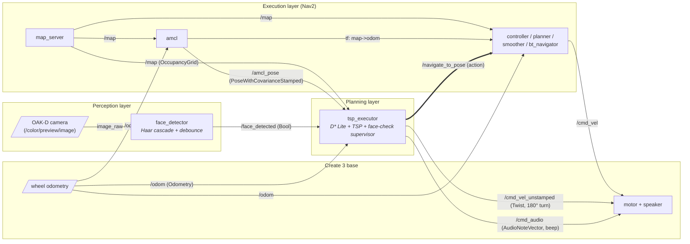

# System Architecture

Block diagram of the three decoupled layers and the ROS 2 topics/actions that
connect them. Solid arrows are publish/subscribe topics; the double-bordered
edge is the `NavigateToPose` action.

## Legend

| Edge                     | Direction                          | Purpose                                               |
| ------------------------ | ---------------------------------- | ----------------------------------------------------- |
| `/map`                   | map_server → tsp_executor, Nav2    | Static occupancy grid (latched, TRANSIENT_LOCAL)      |
| `/amcl_pose`             | amcl → tsp_executor                | Robot pose estimate in the `map` frame                |
| `/odom`                  | Create 3 → tsp_executor, Nav2, amcl| Wheel odometry; used for distance + yaw integration   |
| `/face_detected`         | face_detector → tsp_executor       | Debounced Bool flag                                   |
| `/navigate_to_pose`      | tsp_executor → Nav2 (action)       | One goal per leg of the tour                          |
| `/cmd_vel_unstamped`     | tsp_executor → Create 3            | Open-loop angular velocity during the 180° turn       |
| `/cmd_audio`             | tsp_executor → Create 3            | 880 Hz / 200 ms notes while waiting for a face        |
| `/cmd_vel`               | Nav2 → Create 3                    | Closed-loop velocity from the Nav2 controller server  |

## Legend

| Edge                     | Direction                          | Purpose                                               |
| ------------------------ | ---------------------------------- | ----------------------------------------------------- |
| `/map`                   | map_server → tsp_executor, Nav2    | Static occupancy grid (latched, TRANSIENT_LOCAL)      |
| `/amcl_pose`             | amcl → tsp_executor                | Robot pose estimate in the `map` frame                |
| `/odom`                  | Create 3 → tsp_executor, Nav2, amcl| Wheel odometry; used for distance + yaw integration   |
| `/face_detected`         | face_detector → tsp_executor       | Debounced Bool flag                                   |
| `/navigate_to_pose`      | tsp_executor → Nav2 (action)       | One goal per leg of the tour                          |
| `/cmd_vel_unstamped`     | tsp_executor → Create 3            | Open-loop angular velocity during the 180° turn       |
| `/cmd_audio`             | tsp_executor → Create 3            | 880 Hz / 200 ms notes while waiting for a face        |
| `/cmd_vel`               | Nav2 → Create 3                    | Closed-loop velocity from the Nav2 controller server  |

